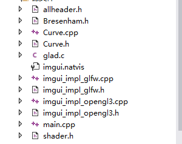
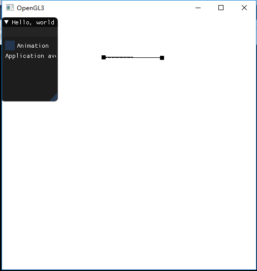
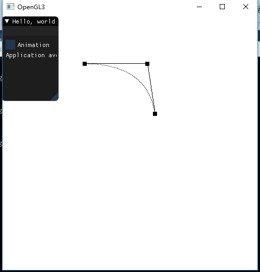
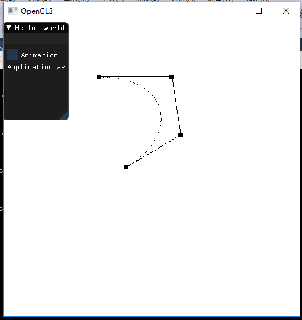
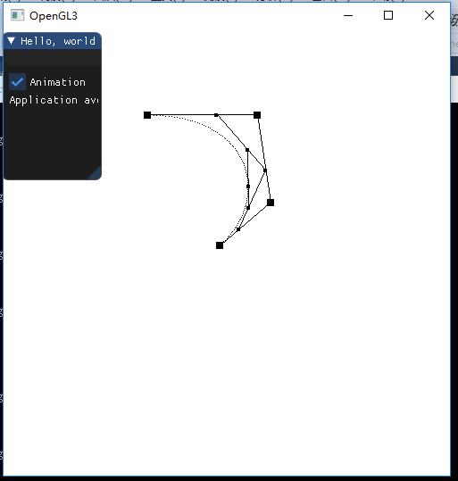
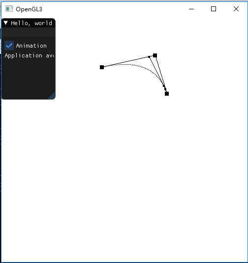
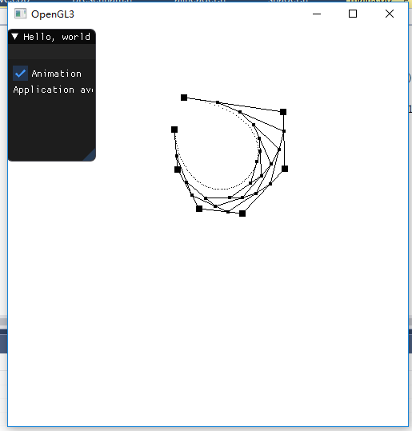

# Homework8
---
## 实验环境
**Windows 10** 

**Visual Studio **

**OpenGL4.3+GLFW+ImGui+GLM**

---

## 实验代码文件分布

关键源代码文件有：**allheader.h:引入相应的头文件、库、命名空间的使用**，**shader.h：负责着色器程序的创建、编译、使用、uniform变量的设定**，**main.cpp：主逻辑的实现**。同时还有文件：

+ **Bresenham.h**:依据两个点算出对应的直线上的点
+ **Curve.h/cpp**:对Bezier曲线的封装

---

## 作业要求

##### 1.用户能通过左键点击添加Bezier曲线的控制点，右键点击则对当前添加的最后一个控制点进行消除 

> 
>
> 

##### 2. 工具根据鼠标绘制的控制点实时更新Bezier曲线。

##### 3.可以动态地呈现Bezier曲线的生成过程。 

## 程序说明

程序的主要思想是，依据输入的左键点击获取当前鼠标位置，进行相应转换后插入一个顶点数组中，在插入之间在其8个像素点的范围内是否有其它的点，若有，则认为该点已存在，则不允许插入。左键获取当前点，转换后，与最后一个点判断是否为同一个点，若是，则删除。

之后依据顶点，就用Bezier曲线的定义即可，采用循环，其中t由0到1，之间的步长为0.01,每一步计算出一个曲线的顶点。

对于现实曲线的生成，也是对于每个t，利用已有的顶点去确定新的顶点，最终在同层且相邻的顶点之间连线，从而时下一种曲线生成过程的模拟。

最终的效果在视屏：**result.mp4**中。

